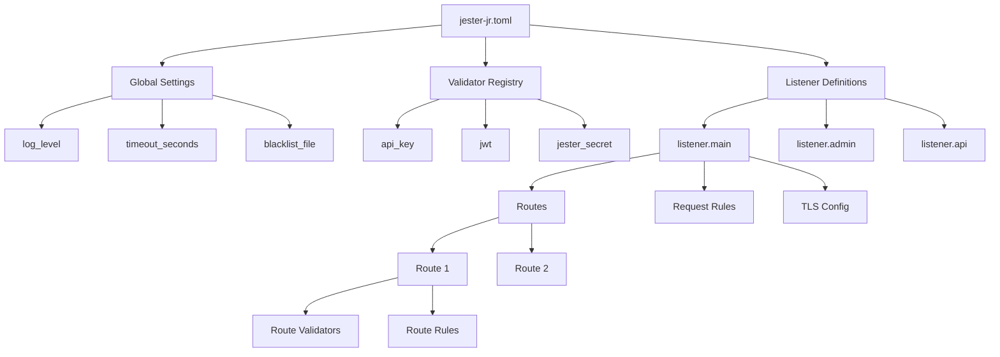

# 🔧 Jester Jr - Complete HOW-TO Guide

**The definitive guide to building, deploying, and configuring Jester Jr reverse proxy for production use.**

## 📑 Table of Contents

1. [🚀 Quick Start](#-quick-start)
2. [🏗️ Building from Source](#-building-from-source)  
3. [📦 Installation Methods](#-installation-methods)
4. [⚙️ Configuration Guide](#-configuration-guide)
5. [🔒 Security Setup](#-security-setup)
6. [🐳 Docker Deployment](#-docker-deployment)
7. [☸️ Kubernetes Deployment](#-kubernetes-deployment)
8. [🖥️ Service Registration](#-service-registration)
9. [📊 Monitoring & Logging](#-monitoring--logging)
10. [🔧 Production Tuning](#-production-tuning)
11. [🚨 Troubleshooting](#-troubleshooting)

---

## 🚀 Quick Start

### Prerequisites Check
```bash
# Verify Rust installation (1.75+ required)
rustc --version
# If not installed: curl --proto '=https' --tlsv1.2 -sSf https://sh.rustup.rs | sh

# Verify system requirements
uname -a  # Linux, macOS, or Windows
free -h   # Minimum 512MB RAM recommended
df -h     # At least 1GB free disk space
```

### 5-Minute Setup
```bash
# 1. Clone and build
git clone https://github.com/alexh-scrt/jester-jr
cd jester-jr
cargo build --release

# 2. Create minimal config
cat > jester-jr.toml << 'EOF'
[global]
log_level = "info"

[listener.main]
ip = "127.0.0.1"
port = 8080
description = "Main HTTP proxy"

[[listener.main.routes]]
name = "default"
path_prefix = "/"
backend = "httpbin.org:80"
EOF

# 3. Test run
./target/release/jester-jr jester-jr.toml &

# 4. Verify
curl http://localhost:8080/get
# Should return JSON response from httpbin.org

# 5. Stop
kill %1
```

---

## 🏗️ Building from Source

### Option 1: Release Build (Production)
```bash
# Clone repository
git clone https://github.com/alexh-scrt/jester-jr
cd jester-jr

# Build optimized release
cargo build --release

# Binary location
ls -lh target/release/jester-jr
# ~8MB binary, fully optimized

# Optional: Strip symbols for smaller size
strip target/release/jester-jr
ls -lh target/release/jester-jr
# ~5MB after stripping
```

### Option 2: Development Build
```bash
# Faster builds, debug symbols included
cargo build

# Run tests
cargo test

# Run with automatic rebuild
cargo run -- jester-jr.toml
```

### Option 3: Cross-Platform Builds
```bash
# Install cross-compilation tools
rustup target add x86_64-unknown-linux-musl
rustup target add x86_64-pc-windows-gnu
rustup target add x86_64-apple-darwin

# Build for Linux (static binary)
cargo build --release --target x86_64-unknown-linux-musl

# Build for Windows
cargo build --release --target x86_64-pc-windows-gnu

# Build universal macOS binary
cargo build --release --target x86_64-apple-darwin
```

### Build Customization
```bash
# Enable all features
cargo build --release --all-features

# Disable TLS support (smaller binary)
cargo build --release --no-default-features

# Build with specific features
cargo build --release --features "tls-support,validator-framework"
```

---

## 📦 Installation Methods

### Method 1: Manual Installation
```bash
# Copy binary to system location
sudo cp target/release/jester-jr /usr/local/bin/

# Make executable
sudo chmod +x /usr/local/bin/jester-jr

# Create config directory
sudo mkdir -p /etc/jester-jr

# Create user and group
sudo useradd -r -s /bin/false jester-jr
sudo mkdir -p /var/lib/jester-jr
sudo chown jester-jr:jester-jr /var/lib/jester-jr
```

### Method 2: Package Managers (Future)
```bash
# Homebrew (macOS/Linux)
brew tap alexh-scrt/jester-jr
brew install jester-jr

# APT (Ubuntu/Debian)
curl -fsSL https://repo.jester-jr.com/gpg | sudo apt-key add -
echo "deb https://repo.jester-jr.com/apt stable main" | sudo tee /etc/apt/sources.list.d/jester-jr.list
sudo apt update && sudo apt install jester-jr

# YUM (RHEL/CentOS/Fedora)
sudo yum-config-manager --add-repo https://repo.jester-jr.com/yum/jester-jr.repo
sudo yum install jester-jr

# Cargo
cargo install --git https://github.com/alexh-scrt/jester-jr jester-jr
```

### Method 3: Pre-compiled Binaries
```bash
# Download latest release
LATEST=$(curl -s https://api.github.com/repos/alexh-scrt/jester-jr/releases/latest | grep -Po '"tag_name": "\K[^"]*')
curl -L "https://github.com/alexh-scrt/jester-jr/releases/download/${LATEST}/jester-jr-linux-x86_64.tar.gz" | tar -xz

# Install
sudo mv jester-jr /usr/local/bin/
sudo chmod +x /usr/local/bin/jester-jr
```

---

## ⚙️ Configuration Guide

### Configuration File Structure

Jester Jr uses TOML format with the following hierarchy:



### Complete Configuration Example

```toml
# ═══════════════════════════════════════════════════════════════════════════════
# GLOBAL CONFIGURATION
# ═══════════════════════════════════════════════════════════════════════════════

[global]
# Logging level: "trace", "debug", "info", "warn", "error"
log_level = "info"

# Global connection timeout (applies to all listeners unless overridden)
timeout_seconds = 30

# IP blacklist file location (JSON format)
blacklist_file = "/var/lib/jester-jr/blacklist.json"

# Global blacklist TTL (hours)
blacklist_ttl_hours = 24

# ═══════════════════════════════════════════════════════════════════════════════
# VALIDATOR REGISTRY
# Define reusable validators that can be applied to routes
# ═══════════════════════════════════════════════════════════════════════════════

# API Key validator
[validators.api_key]
type = "builtin"

[validators.api_key.config]
valid_keys = [
    "prod-key-abc123",
    "stage-key-def456",
    "dev-key-ghi789"
]
header_name = "x-api-key"

# JWT Token validator  
[validators.jwt]
type = "builtin"

[validators.jwt.config]
secret = "your-jwt-secret-key-here"
algorithm = "HS256"
issuer = "your-company.com"
audience = "api-users"
header_name = "authorization"  # Expects "Bearer <token>"

# Custom secret validator (for internal services)
[validators.jester_secret]
type = "builtin"

[validators.jester_secret.config]
valid_keys = ["internal-service-secret-xyz"]
header_name = "jester-secret"
blacklist_ttl_hours = 1  # Fast blacklist expiry for testing

# Custom Rhai script validator
[validators.custom_auth]
type = "script"

[validators.custom_auth.config]
script_path = "/etc/jester-jr/validators/custom_auth.rhai"
timeout_ms = 500

# WASM validator (advanced)
[validators.wasm_auth]
type = "wasm"

[validators.wasm_auth.config]
wasm_path = "/etc/jester-jr/validators/auth.wasm"
function_name = "validate_request"
timeout_ms = 1000

# ═══════════════════════════════════════════════════════════════════════════════
# LISTENER DEFINITIONS
# Define different listeners for different purposes
# ═══════════════════════════════════════════════════════════════════════════════

# ────────────────────────────────────────────────────────────────────────────────
# Main Production API Listener (HTTPS)
# ────────────────────────────────────────────────────────────────────────────────

[listener.main]
ip = "0.0.0.0"              # Listen on all interfaces
port = 443                  # Standard HTTPS port
description = "Production HTTPS API Gateway"
default_action = "reject"   # Reject unmatched requests
read_timeout = 30          # Override global timeout for this listener
write_timeout = 30

# TLS Configuration
[listener.main.tls]
enabled = true
cert_file = "/etc/ssl/certs/api.example.com.pem"
key_file = "/etc/ssl/private/api.example.com.key"

# Global listener rules (apply to ALL routes on this listener)
[[listener.main.request_rules]]
name = "Block dangerous methods globally"
action = "deny"
methods = ["DELETE", "TRACE", "TRACK", "CONNECT"]

[[listener.main.request_rules]]
name = "Block admin paths globally"
action = "deny"
path_regex = "^/admin/.*"

# Public API Routes (require API key)
[[listener.main.routes]]
name = "public-api-v1"
path_prefix = "/api/v1"
backend = "api-server:8080"
strip_prefix = true         # /api/v1/users → /users
description = "Public API endpoints requiring API key"

# Apply API key validation
[[listener.main.routes.validators]]
validator = "api_key"
on_failure = "deny"

# Route-specific rules
[[listener.main.routes.request_rules]]
name = "Allow standard HTTP methods for API"
action = "allow"
methods = ["GET", "POST", "PUT", "PATCH"]

[[listener.main.routes.response_rules]]
name = "Hide server errors from API clients"
action = "deny"
status_codes = [500, 501, 502, 503, 504]

# Internal API Routes (require JWT)
[[listener.main.routes]]
name = "internal-api"
path_prefix = "/api/internal"
backend = "internal-api:8080"
strip_prefix = true

# Apply JWT validation
[[listener.main.routes.validators]]
validator = "jwt"
on_failure = "deny"

# Public Health Check (no authentication)
[[listener.main.routes]]
name = "health-check"
path_prefix = "/health"
backend = "api-server:8080"
strip_prefix = false

# No validators for health check - open to public

[[listener.main.routes.request_rules]]
name = "Health check GET only"
action = "allow"
methods = ["GET", "HEAD"]

# ────────────────────────────────────────────────────────────────────────────────
# Admin Interface Listener (HTTPS, Restricted IP)
# ────────────────────────────────────────────────────────────────────────────────

[listener.admin]
ip = "10.0.0.100"          # Internal IP only
port = 8443                 # Custom HTTPS port
description = "Admin Interface (Internal Only)"
default_action = "reject"

# TLS for admin interface
[listener.admin.tls]
enabled = true
cert_file = "/etc/ssl/certs/admin.internal.pem"
key_file = "/etc/ssl/private/admin.internal.key"

# Admin routes require Jester-Secret
[[listener.admin.routes]]
name = "admin-panel"
path_prefix = "/admin"
backend = "admin-service:8080"
strip_prefix = false

[[listener.admin.routes.validators]]
validator = "jester_secret"
on_failure = "deny"

# ────────────────────────────────────────────────────────────────────────────────
# Development Listener (HTTP, Permissive)
# ────────────────────────────────────────────────────────────────────────────────

[listener.dev]
ip = "127.0.0.1"           # Localhost only
port = 8080                # Standard HTTP port
description = "Development Server (Local Only)"
default_action = "forward" # Forward unmatched requests

# No TLS for development
[listener.dev.tls]
enabled = false

# Catch-all development route
[[listener.dev.routes]]
name = "dev-backend"
path_prefix = "/"
backend = "localhost:3000"
strip_prefix = false

# Allow all methods in development
[[listener.dev.routes.request_rules]]
name = "Allow all methods for development"
action = "allow"
methods = ["GET", "POST", "PUT", "PATCH", "DELETE", "HEAD", "OPTIONS"]

# ────────────────────────────────────────────────────────────────────────────────
# Metrics Listener (HTTP, Prometheus)
# ────────────────────────────────────────────────────────────────────────────────

[listener.metrics]
ip = "0.0.0.0"
port = 9090                # Prometheus standard port
description = "Metrics and Monitoring"
default_action = "reject"

# No TLS for metrics (typically behind firewall)
[listener.metrics.tls]
enabled = false

# Prometheus metrics endpoint
[[listener.metrics.routes]]
name = "prometheus-metrics"
path_prefix = "/metrics"
backend = "metrics-service:8080"
strip_prefix = false

# Health checks for monitoring
[[listener.metrics.routes]]
name = "monitoring-health"
path_prefix = "/health"
backend = "health-service:8080"
strip_prefix = false

# ═══════════════════════════════════════════════════════════════════════════════
# ADVANCED CONFIGURATION EXAMPLES
# ═══════════════════════════════════════════════════════════════════════════════

# Example: Rate limiting route (v0.2.0 feature)
# [[listener.main.routes]]
# name = "rate-limited-api"
# path_prefix = "/api/limited"
# backend = "limited-service:8080"
# 
# [listener.main.routes.rate_limit]
# requests_per_minute = 60
# burst_size = 10
# per_ip = true

# Example: Load balancing (v0.2.0 feature)
# [[listener.main.routes]]
# name = "load-balanced-api"
# path_prefix = "/api/lb"
# 
# [listener.main.routes.backends]
# strategy = "round_robin"  # round_robin, weighted, least_connections
# health_check = "/health"
# servers = [
#     { address = "backend1:8080", weight = 1 },
#     { address = "backend2:8080", weight = 2 },
#     { address = "backend3:8080", weight = 1 }
# ]

# ═══════════════════════════════════════════════════════════════════════════════
# CONFIGURATION VALIDATION
# The proxy validates this configuration on startup and will fail fast if invalid.
# Check logs for detailed validation errors if startup fails.
# ═══════════════════════════════════════════════════════════════════════════════
```

### Environment-Specific Configurations

#### Development Environment
```toml
# jester-jr.dev.toml - Development configuration

[global]
log_level = "debug"  # Verbose logging for debugging
timeout_seconds = 5  # Fast timeouts to catch issues early

[listener.dev]
ip = "127.0.0.1"
port = 8080
description = "Local development proxy"
default_action = "forward"

# Simple catch-all route for development
[[listener.dev.routes]]
name = "dev-server"
path_prefix = "/"
backend = "localhost:3000"

# Allow all methods for testing
[[listener.dev.routes.request_rules]]
name = "Allow everything in dev"
action = "allow"
```

#### Staging Environment
```toml
# jester-jr.staging.toml - Staging configuration

[global]
log_level = "info"
timeout_seconds = 15

# API key for staging environment
[validators.staging_api_key]
type = "builtin"
config = { valid_keys = ["staging-key-123"], header_name = "x-api-key" }

[listener.staging]
ip = "0.0.0.0"
port = 8443
description = "Staging HTTPS API"

[listener.staging.tls]
enabled = true
cert_file = "/etc/ssl/staging/cert.pem"
key_file = "/etc/ssl/staging/key.pem"

[[listener.staging.routes]]
name = "staging-api"
path_prefix = "/api"
backend = "staging-api:8080"

[[listener.staging.routes.validators]]
validator = "staging_api_key"
on_failure = "deny"
```

#### Production Environment
```toml
# jester-jr.prod.toml - Production configuration

[global]
log_level = "warn"  # Minimal logging for performance
timeout_seconds = 30
blacklist_file = "/var/lib/jester-jr/prod-blacklist.json"
blacklist_ttl_hours = 168  # 1 week

# Production API key with multiple valid keys
[validators.prod_api_key]
type = "builtin"
config = { 
    valid_keys = [
        "prod-key-client1-abc123",
        "prod-key-client2-def456",
        "prod-key-mobile-ghi789"
    ], 
    header_name = "x-api-key" 
}

[listener.production]
ip = "0.0.0.0"
port = 443
description = "Production HTTPS API Gateway"
default_action = "reject"

[listener.production.tls]
enabled = true
cert_file = "/etc/ssl/production/fullchain.pem"
key_file = "/etc/ssl/production/privkey.pem"

# Production routes with strict security
[[listener.production.routes]]
name = "prod-api"
path_prefix = "/api"
backend = "prod-api-cluster:8080"

[[listener.production.routes.validators]]
validator = "prod_api_key"
on_failure = "deny"

# Strict production rules
[[listener.production.routes.request_rules]]
name = "Production methods only"
action = "allow"
methods = ["GET", "POST"]

[[listener.production.routes.response_rules]]
name = "Hide all server errors"
action = "deny"
status_codes = [500, 501, 502, 503, 504, 505]
```

### Configuration Validation

```bash
# Validate configuration without starting the service
./target/release/jester-jr --validate-config jester-jr.toml

# Check specific sections
./target/release/jester-jr --validate-config --verbose jester-jr.toml

# Test configuration with dry-run mode
./target/release/jester-jr --dry-run jester-jr.toml
```

---

## 🔒 Security Setup

### TLS/HTTPS Configuration

#### Obtaining Certificates

**Option 1: Let's Encrypt with Certbot**
```bash
# Install certbot
sudo apt install certbot  # Ubuntu/Debian
# sudo yum install certbot  # RHEL/CentOS

# Get certificate for your domain
sudo certbot certonly --standalone -d api.example.com

# Certificates will be in:
# /etc/letsencrypt/live/api.example.com/fullchain.pem
# /etc/letsencrypt/live/api.example.com/privkey.pem

# Configure renewal (automated)
sudo crontab -e
# Add: 0 12 * * * /usr/bin/certbot renew --quiet
```

**Option 2: Manual Certificate Setup**
```bash
# Create directory structure
sudo mkdir -p /etc/jester-jr/ssl
sudo chmod 700 /etc/jester-jr/ssl

# Copy your certificate files
sudo cp your-cert.pem /etc/jester-jr/ssl/
sudo cp your-key.pem /etc/jester-jr/ssl/
sudo chmod 600 /etc/jester-jr/ssl/*
sudo chown jester-jr:jester-jr /etc/jester-jr/ssl/*
```

**Option 3: Self-Signed Certificates (Testing Only)**
```bash
# Generate self-signed certificate
openssl req -x509 -newkey rsa:4096 -keyout key.pem -out cert.pem -days 365 -nodes \
    -subj "/CN=localhost/O=Jester Jr Test/C=US"

# Use in configuration
[listener.main.tls]
enabled = true
cert_file = "./cert.pem"
key_file = "./key.pem"
```

#### IP Blacklisting Configuration

```toml
[global]
blacklist_file = "/var/lib/jester-jr/blacklist.json"
blacklist_ttl_hours = 24

# Automatic blacklisting for TLS failures
[listeners.main.tls_failure_tracking]
enabled = true
max_attempts = 3
time_window_minutes = 5
blacklist_ttl_hours = 24
```

**Manual IP Blacklisting**
```bash
# Add IP to blacklist (JSON format)
cat > /var/lib/jester-jr/blacklist.json << 'EOF'
{
  "192.168.1.100": {
    "blocked_at": "2024-01-01T12:00:00Z",
    "ttl_hours": 24,
    "reason": "Manual block - suspicious activity"
  },
  "10.0.0.50": {
    "blocked_at": "2024-01-01T13:00:00Z", 
    "ttl_hours": 168,
    "reason": "Persistent attacks"
  }
}
EOF

# Clear blacklist 
echo "{}" > /var/lib/jester-jr/blacklist.json

# Or use the provided script
./clear_blacklist.sh
```

#### Custom Validators

**Rhai Script Validator Example**
```rust
// /etc/jester-jr/validators/custom_auth.rhai
// Custom authentication logic in Rhai script

fn validate_request(context) {
    // Get request information
    let headers = context.headers;
    let method = context.method;
    let path = context.path;
    let ip = context.client_ip;
    
    // Custom validation logic
    if method == "POST" && !headers.contains("content-type") {
        return #{ allowed: false, reason: "POST requires Content-Type header" };
    }
    
    // IP-based restrictions
    if ip.starts_with("192.168.") && path.starts_with("/admin/") {
        return #{ allowed: false, reason: "Admin access denied from internal network" };
    }
    
    // Custom header validation
    if let Some(user_agent) = headers.get("user-agent") {
        if user_agent.contains("bot") || user_agent.contains("crawler") {
            return #{ allowed: false, reason: "Bots not allowed" };
        }
    }
    
    // Time-based restrictions
    let current_hour = timestamp().hour();
    if path.starts_with("/maintenance/") && (current_hour < 2 || current_hour > 4) {
        return #{ allowed: false, reason: "Maintenance window is 2-4 AM only" };
    }
    
    // Allow request
    return #{ allowed: true, reason: "Custom validation passed" };
}
```

**WASM Validator (Advanced)**
```rust
// validators/src/lib.rs - WASM validator example
use serde::{Deserialize, Serialize};
use std::collections::HashMap;

#[derive(Deserialize)]
pub struct ValidationContext {
    pub method: String,
    pub path: String,
    pub headers: HashMap<String, String>,
    pub client_ip: String,
}

#[derive(Serialize)]
pub struct ValidationResult {
    pub allowed: bool,
    pub reason: String,
}

#[no_mangle]
pub extern "C" fn validate_request(context_ptr: *const u8, context_len: usize) -> *const u8 {
    // Deserialize context from memory
    let context_slice = unsafe { std::slice::from_raw_parts(context_ptr, context_len) };
    let context: ValidationContext = match serde_json::from_slice(context_slice) {
        Ok(ctx) => ctx,
        Err(_) => return serialize_result(ValidationResult {
            allowed: false,
            reason: "Invalid context".to_string(),
        }),
    };
    
    // Custom validation logic
    let result = if context.path.starts_with("/restricted/") {
        let has_token = context.headers.get("authorization")
            .map(|auth| auth.starts_with("Bearer "))
            .unwrap_or(false);
            
        if has_token {
            ValidationResult { allowed: true, reason: "Token validated".to_string() }
        } else {
            ValidationResult { allowed: false, reason: "Missing bearer token".to_string() }
        }
    } else {
        ValidationResult { allowed: true, reason: "Public endpoint".to_string() }
    };
    
    serialize_result(result)
}

fn serialize_result(result: ValidationResult) -> *const u8 {
    // Implementation details for WASM memory management
    // ... (simplified for brevity)
    std::ptr::null()
}
```

### Security Best Practices

```toml
# Production security configuration template

[global]
log_level = "warn"  # Don't log sensitive data
blacklist_ttl_hours = 168  # Keep bad IPs blocked for 1 week

# Secure JWT configuration
[validators.secure_jwt]
type = "builtin"
config = {
    secret = "${JWT_SECRET}",  # Use environment variable
    algorithm = "RS256",       # Asymmetric algorithm preferred
    issuer = "your-domain.com",
    audience = "api-clients",
    leeway = 30               # 30 second clock skew allowance
}

[listener.production]
ip = "0.0.0.0"
port = 443
default_action = "reject"    # Deny by default
read_timeout = 10           # Short timeouts prevent slowloris
write_timeout = 10

# Strong TLS configuration  
[listener.production.tls]
enabled = true
cert_file = "/etc/ssl/production/fullchain.pem"
key_file = "/etc/ssl/production/privkey.pem"

# Security-first global rules
[[listener.production.request_rules]]
name = "Block dangerous methods"
action = "deny"
methods = ["DELETE", "TRACE", "TRACK", "CONNECT"]

[[listener.production.request_rules]]
name = "Block admin paths"
action = "deny"
path_regex = "^/(admin|config|debug|internal)/.*"

[[listener.production.request_rules]]
name = "Require User-Agent"
action = "deny"
missing_headers = ["user-agent"]

# Response security
[[listener.production.response_rules]]
name = "Hide server errors"
action = "deny"
status_codes = [500, 501, 502, 503, 504, 505]

[[listener.production.response_rules]]
name = "Limit response size"
action = "deny"
max_size_bytes = 10485760  # 10MB limit
```

---

## 🐳 Docker Deployment

### Basic Docker Setup

**Dockerfile**
```dockerfile
# Multi-stage build for optimal size
FROM rust:1.75-alpine AS builder

# Install build dependencies
RUN apk add --no-cache musl-dev openssl-dev

# Create app directory
WORKDIR /app

# Copy source code
COPY . .

# Build release binary
RUN cargo build --release --target x86_64-unknown-linux-musl

# Runtime stage
FROM alpine:latest

# Install runtime dependencies
RUN apk add --no-cache ca-certificates tzdata

# Create app user
RUN addgroup -g 1000 jester-jr && \
    adduser -D -s /bin/sh -u 1000 -G jester-jr jester-jr

# Create directories
RUN mkdir -p /app /var/lib/jester-jr /etc/jester-jr && \
    chown -R jester-jr:jester-jr /app /var/lib/jester-jr /etc/jester-jr

# Copy binary from builder
COPY --from=builder /app/target/x86_64-unknown-linux-musl/release/jester-jr /app/
COPY --from=builder /app/test-config-aligned.toml /etc/jester-jr/

# Switch to app user
USER jester-jr

# Set working directory
WORKDIR /app

# Health check
HEALTHCHECK --interval=30s --timeout=3s --start-period=5s --retries=3 \
    CMD wget --quiet --tries=1 --spider http://localhost:8090/health || exit 1

# Expose ports
EXPOSE 8090 8443

# Run jester-jr
ENTRYPOINT ["./jester-jr"]
CMD ["/etc/jester-jr/test-config-aligned.toml"]
```

**Build and Run**
```bash
# Build image
docker build -t jester-jr:latest .

# Run with custom config
docker run -d \
    --name jester-jr \
    -p 8080:8080 \
    -p 8443:8443 \
    -v $(pwd)/jester-jr.toml:/etc/jester-jr/jester-jr.toml:ro \
    -v $(pwd)/ssl:/etc/ssl:ro \
    --restart unless-stopped \
    jester-jr:latest /etc/jester-jr/jester-jr.toml

# View logs
docker logs -f jester-jr

# Health check
curl http://localhost:8080/health
```

### Docker Compose Setup

**docker-compose.yml**
```yaml
version: '3.8'

services:
  # Jester Jr reverse proxy
  jester-jr:
    build: .
    container_name: jester-jr
    restart: unless-stopped
    ports:
      - "80:8080"      # HTTP
      - "443:8443"     # HTTPS
      - "9090:9090"    # Metrics
    volumes:
      - ./config/jester-jr.toml:/etc/jester-jr/jester-jr.toml:ro
      - ./ssl:/etc/ssl:ro
      - ./data:/var/lib/jester-jr
      - ./logs:/var/log/jester-jr
    environment:
      - RUST_LOG=info
      - TZ=UTC
    depends_on:
      - backend
    networks:
      - proxy-network
    healthcheck:
      test: ["CMD", "wget", "--quiet", "--spider", "http://localhost:8090/health"]
      interval: 30s
      timeout: 10s
      retries: 3
      start_period: 40s
    deploy:
      resources:
        limits:
          memory: 128M
          cpus: '0.5'
        reservations:
          memory: 64M
          cpus: '0.25'

  # Example backend service
  backend:
    image: nginx:alpine
    container_name: backend
    restart: unless-stopped
    volumes:
      - ./backend/nginx.conf:/etc/nginx/nginx.conf:ro
      - ./backend/html:/usr/share/nginx/html:ro
    networks:
      - proxy-network
    expose:
      - "80"

  # Metrics collector (optional)
  prometheus:
    image: prom/prometheus:latest
    container_name: prometheus
    restart: unless-stopped
    ports:
      - "9091:9090"
    volumes:
      - ./monitoring/prometheus.yml:/etc/prometheus/prometheus.yml:ro
      - prometheus-data:/prometheus
    command:
      - '--config.file=/etc/prometheus/prometheus.yml'
      - '--storage.tsdb.path=/prometheus'
      - '--web.console.libraries=/etc/prometheus/console_libraries'
      - '--web.console.templates=/etc/prometheus/consoles'
    networks:
      - proxy-network

  # Log aggregation (optional)
  fluentd:
    image: fluent/fluentd:v1.14-debian
    container_name: fluentd
    restart: unless-stopped
    volumes:
      - ./logging/fluent.conf:/fluentd/etc/fluent.conf:ro
      - /var/log:/var/log:ro
    networks:
      - proxy-network
    environment:
      - FLUENTD_CONF=fluent.conf

networks:
  proxy-network:
    driver: bridge
    ipam:
      config:
        - subnet: 172.20.0.0/16

volumes:
  prometheus-data:
  logs:
```

**Production Docker Compose with Secrets**
```yaml
version: '3.8'

services:
  jester-jr:
    image: ghcr.io/alexh-scrt/jester-jr:v0.1.0
    container_name: jester-jr-prod
    restart: unless-stopped
    ports:
      - "80:8080"
      - "443:8443"
    volumes:
      - ./config/production.toml:/etc/jester-jr/jester-jr.toml:ro
      - ssl-certs:/etc/ssl:ro
      - jester-data:/var/lib/jester-jr
    secrets:
      - jwt-secret
      - api-keys
    environment:
      - RUST_LOG=warn
      - JWT_SECRET_FILE=/run/secrets/jwt-secret
      - API_KEYS_FILE=/run/secrets/api-keys
    networks:
      - frontend
      - backend
    deploy:
      replicas: 3
      resources:
        limits:
          memory: 256M
          cpus: '1.0'
        reservations:
          memory: 128M
          cpus: '0.5'
      restart_policy:
        condition: any
        delay: 10s
        max_attempts: 3

secrets:
  jwt-secret:
    external: true
  api-keys:
    external: true

volumes:
  ssl-certs:
    external: true
  jester-data:

networks:
  frontend:
    external: true
  backend:
    external: true
```

---

## ☸️ Kubernetes Deployment

### Basic Kubernetes Manifests

**namespace.yaml**
```yaml
apiVersion: v1
kind: Namespace
metadata:
  name: jester-jr
  labels:
    app.kubernetes.io/name: jester-jr
    app.kubernetes.io/version: "0.1.0"
```

**configmap.yaml**
```yaml
apiVersion: v1
kind: ConfigMap
metadata:
  name: jester-jr-config
  namespace: jester-jr
data:
  jester-jr.toml: |
    [global]
    log_level = "info"
    timeout_seconds = 30
    blacklist_file = "/var/lib/jester-jr/blacklist.json"

    [validators.api_key]
    type = "builtin"
    config = { valid_keys = ["${API_KEY}"], header_name = "x-api-key" }

    [listener.main]
    ip = "0.0.0.0"
    port = 8080
    description = "Kubernetes HTTP Gateway"
    default_action = "reject"

    [[listener.main.routes]]
    name = "api"
    path_prefix = "/api"
    backend = "backend-service:80"
    strip_prefix = true

    [[listener.main.routes.validators]]
    validator = "api_key"
    on_failure = "deny"

    [[listener.main.routes]]
    name = "health"
    path_prefix = "/health"
    backend = "backend-service:80"
```

**secret.yaml**
```yaml
apiVersion: v1
kind: Secret
metadata:
  name: jester-jr-secrets
  namespace: jester-jr
type: Opaque
data:
  # Base64 encoded values
  api-key: cHJvZC1rZXktYWJjMTIz  # prod-key-abc123
  jwt-secret: bXktand0LXNlY3JldC1rZXk=  # my-jwt-secret-key
---
apiVersion: v1
kind: Secret
metadata:
  name: jester-jr-tls
  namespace: jester-jr
type: kubernetes.io/tls
data:
  tls.crt: LS0tLS1CRUdJTi...  # Base64 encoded cert
  tls.key: LS0tLS1CRUdJTi...  # Base64 encoded private key
```

**deployment.yaml**
```yaml
apiVersion: apps/v1
kind: Deployment
metadata:
  name: jester-jr
  namespace: jester-jr
  labels:
    app.kubernetes.io/name: jester-jr
    app.kubernetes.io/version: "0.1.0"
    app.kubernetes.io/component: proxy
spec:
  replicas: 3
  selector:
    matchLabels:
      app.kubernetes.io/name: jester-jr
  template:
    metadata:
      labels:
        app.kubernetes.io/name: jester-jr
      annotations:
        prometheus.io/scrape: "true"
        prometheus.io/port: "9090"
        prometheus.io/path: "/metrics"
    spec:
      serviceAccountName: jester-jr
      containers:
      - name: jester-jr
        image: ghcr.io/alexh-scrt/jester-jr:v0.1.0
        ports:
        - name: http
          containerPort: 8080
          protocol: TCP
        - name: https
          containerPort: 8443
          protocol: TCP
        - name: metrics
          containerPort: 9090
          protocol: TCP
        env:
        - name: RUST_LOG
          value: "info"
        - name: API_KEY
          valueFrom:
            secretKeyRef:
              name: jester-jr-secrets
              key: api-key
        volumeMounts:
        - name: config
          mountPath: /etc/jester-jr
          readOnly: true
        - name: tls-certs
          mountPath: /etc/ssl
          readOnly: true
        - name: data
          mountPath: /var/lib/jester-jr
        resources:
          requests:
            memory: "64Mi"
            cpu: "100m"
          limits:
            memory: "256Mi"
            cpu: "500m"
        livenessProbe:
          httpGet:
            path: /health
            port: 8080
          initialDelaySeconds: 30
          periodSeconds: 10
          timeoutSeconds: 5
          failureThreshold: 3
        readinessProbe:
          httpGet:
            path: /health
            port: 8080
          initialDelaySeconds: 5
          periodSeconds: 5
          timeoutSeconds: 3
          failureThreshold: 2
        securityContext:
          allowPrivilegeEscalation: false
          runAsNonRoot: true
          runAsUser: 1000
          runAsGroup: 1000
          capabilities:
            drop:
            - ALL
          readOnlyRootFilesystem: true
      volumes:
      - name: config
        configMap:
          name: jester-jr-config
      - name: tls-certs
        secret:
          secretName: jester-jr-tls
      - name: data
        emptyDir: {}
      affinity:
        podAntiAffinity:
          preferredDuringSchedulingIgnoredDuringExecution:
          - weight: 100
            podAffinityTerm:
              labelSelector:
                matchExpressions:
                - key: app.kubernetes.io/name
                  operator: In
                  values:
                  - jester-jr
              topologyKey: kubernetes.io/hostname
```

**service.yaml**
```yaml
apiVersion: v1
kind: Service
metadata:
  name: jester-jr
  namespace: jester-jr
  labels:
    app.kubernetes.io/name: jester-jr
spec:
  selector:
    app.kubernetes.io/name: jester-jr
  ports:
  - name: http
    port: 80
    targetPort: 8080
    protocol: TCP
  - name: https
    port: 443
    targetPort: 8443
    protocol: TCP
  type: ClusterIP
---
apiVersion: v1
kind: Service
metadata:
  name: jester-jr-metrics
  namespace: jester-jr
  labels:
    app.kubernetes.io/name: jester-jr
    app.kubernetes.io/component: metrics
spec:
  selector:
    app.kubernetes.io/name: jester-jr
  ports:
  - name: metrics
    port: 9090
    targetPort: 9090
    protocol: TCP
  type: ClusterIP
```

**ingress.yaml**
```yaml
apiVersion: networking.k8s.io/v1
kind: Ingress
metadata:
  name: jester-jr-ingress
  namespace: jester-jr
  annotations:
    kubernetes.io/ingress.class: nginx
    cert-manager.io/cluster-issuer: letsencrypt-prod
    nginx.ingress.kubernetes.io/backend-protocol: "HTTP"
    nginx.ingress.kubernetes.io/proxy-body-size: "10m"
    nginx.ingress.kubernetes.io/proxy-read-timeout: "60"
    nginx.ingress.kubernetes.io/proxy-send-timeout: "60"
spec:
  tls:
  - hosts:
    - api.example.com
    secretName: jester-jr-tls-ingress
  rules:
  - host: api.example.com
    http:
      paths:
      - path: /
        pathType: Prefix
        backend:
          service:
            name: jester-jr
            port:
              number: 80
```

**servicemonitor.yaml** (for Prometheus Operator)
```yaml
apiVersion: monitoring.coreos.com/v1
kind: ServiceMonitor
metadata:
  name: jester-jr
  namespace: jester-jr
  labels:
    app.kubernetes.io/name: jester-jr
spec:
  selector:
    matchLabels:
      app.kubernetes.io/name: jester-jr
      app.kubernetes.io/component: metrics
  endpoints:
  - port: metrics
    interval: 30s
    path: /metrics
```

### Helm Chart

**Chart.yaml**
```yaml
apiVersion: v2
name: jester-jr
description: A production-ready reverse proxy built in Rust
type: application
version: 0.1.0
appVersion: "0.1.0"
keywords:
  - proxy
  - reverse-proxy
  - rust
  - http
  - https
home: https://github.com/alexh-scrt/jester-jr
sources:
  - https://github.com/alexh-scrt/jester-jr
maintainers:
  - name: alexh-scrt
    email: alex@example.com
```

**values.yaml**
```yaml
# Default values for jester-jr

replicaCount: 3

image:
  repository: ghcr.io/alexh-scrt/jester-jr
  pullPolicy: IfNotPresent
  tag: "v0.1.0"

nameOverride: ""
fullnameOverride: ""

serviceAccount:
  create: true
  annotations: {}
  name: ""

podAnnotations: {}

podSecurityContext:
  fsGroup: 1000

securityContext:
  allowPrivilegeEscalation: false
  capabilities:
    drop:
    - ALL
  readOnlyRootFilesystem: true
  runAsNonRoot: true
  runAsUser: 1000

service:
  type: ClusterIP
  http:
    port: 80
    targetPort: 8080
  https:
    port: 443
    targetPort: 8443
  metrics:
    port: 9090
    targetPort: 9090

ingress:
  enabled: true
  className: "nginx"
  annotations:
    cert-manager.io/cluster-issuer: letsencrypt-prod
  hosts:
    - host: api.example.com
      paths:
        - path: /
          pathType: Prefix
  tls:
    - secretName: jester-jr-tls
      hosts:
        - api.example.com

resources:
  limits:
    cpu: 500m
    memory: 256Mi
  requests:
    cpu: 100m
    memory: 64Mi

autoscaling:
  enabled: false
  minReplicas: 2
  maxReplicas: 10
  targetCPUUtilizationPercentage: 80
  targetMemoryUtilizationPercentage: 80

nodeSelector: {}

tolerations: []

affinity:
  podAntiAffinity:
    preferredDuringSchedulingIgnoredDuringExecution:
    - weight: 100
      podAffinityTerm:
        labelSelector:
          matchExpressions:
          - key: app.kubernetes.io/name
            operator: In
            values:
            - jester-jr
        topologyKey: kubernetes.io/hostname

config:
  global:
    logLevel: "info"
    timeoutSeconds: 30
    blacklistFile: "/var/lib/jester-jr/blacklist.json"
  
  validators:
    apiKey:
      type: "builtin"
      validKeys: 
        - "prod-key-abc123"
      headerName: "x-api-key"
  
  listeners:
    main:
      ip: "0.0.0.0"
      port: 8080
      description: "Kubernetes HTTP Gateway"
      defaultAction: "reject"
      
      routes:
        - name: "api"
          pathPrefix: "/api"
          backend: "backend-service:80"
          stripPrefix: true
          validators:
            - validator: "apiKey"
              onFailure: "deny"
        
        - name: "health"
          pathPrefix: "/health"  
          backend: "backend-service:80"
          stripPrefix: false

monitoring:
  enabled: true
  serviceMonitor:
    enabled: true
    interval: 30s
    path: /metrics
```

**Deployment Commands**
```bash
# Deploy with kubectl
kubectl apply -f namespace.yaml
kubectl apply -f configmap.yaml
kubectl apply -f secret.yaml
kubectl apply -f deployment.yaml
kubectl apply -f service.yaml
kubectl apply -f ingress.yaml

# Deploy with Helm
helm repo add jester-jr https://charts.jester-jr.com
helm repo update
helm install my-proxy jester-jr/jester-jr \
  --namespace jester-jr \
  --create-namespace \
  --values values.yaml

# Check deployment status
kubectl get all -n jester-jr
kubectl describe deployment jester-jr -n jester-jr
kubectl logs -f deployment/jester-jr -n jester-jr

# Port forward for testing
kubectl port-forward service/jester-jr 8080:80 -n jester-jr

# Test the deployment
curl http://localhost:8080/health
```

---

## 🖥️ Service Registration

### SystemD Service (Linux)

**Create Service File**
```bash
sudo tee /etc/systemd/system/jester-jr.service << 'EOF'
[Unit]
Description=Jester Jr Reverse Proxy
Documentation=https://github.com/alexh-scrt/jester-jr
After=network.target network-online.target
Wants=network-online.target
AssertFileIsExecutable=/usr/local/bin/jester-jr
AssertFileNotEmpty=/etc/jester-jr/jester-jr.toml

[Service]
Type=simple
User=jester-jr
Group=jester-jr
ExecStart=/usr/local/bin/jester-jr /etc/jester-jr/jester-jr.toml
ExecReload=/bin/kill -USR1 $MAINPID
KillMode=mixed
KillSignal=SIGINT
TimeoutStopSec=30
Restart=on-failure
RestartSec=10

# Security settings
NoNewPrivileges=yes
PrivateTmp=yes
PrivateDevices=yes
ProtectHome=yes
ProtectSystem=strict
ReadWritePaths=/var/lib/jester-jr /var/log/jester-jr

# Resource limits
LimitNOFILE=65536
MemoryLimit=512M

# Environment
Environment=RUST_LOG=info
EnvironmentFile=-/etc/default/jester-jr

# Working directory
WorkingDirectory=/var/lib/jester-jr

# Standard output and error
StandardOutput=journal
StandardError=journal

[Install]
WantedBy=multi-user.target
EOF
```

**Configure Service**
```bash
# Create directories
sudo mkdir -p /etc/jester-jr /var/lib/jester-jr /var/log/jester-jr

# Create user
sudo useradd -r -s /bin/false jester-jr
sudo chown -R jester-jr:jester-jr /var/lib/jester-jr /var/log/jester-jr

# Set permissions
sudo chmod 755 /etc/jester-jr
sudo chmod 750 /var/lib/jester-jr
sudo chmod 750 /var/log/jester-jr

# Install configuration
sudo cp jester-jr.toml /etc/jester-jr/
sudo chmod 644 /etc/jester-jr/jester-jr.toml

# Enable and start service
sudo systemctl daemon-reload
sudo systemctl enable jester-jr
sudo systemctl start jester-jr

# Check status
sudo systemctl status jester-jr
sudo journalctl -u jester-jr -f

# Service management
sudo systemctl stop jester-jr      # Stop service
sudo systemctl restart jester-jr   # Restart service
sudo systemctl reload jester-jr    # Reload config (if supported)
```

**Environment Configuration**
```bash
# Create environment file
sudo tee /etc/default/jester-jr << 'EOF'
# Jester Jr Environment Configuration

# Logging level
RUST_LOG=info

# Security settings
JWT_SECRET=your-jwt-secret-here
API_KEYS=key1,key2,key3

# Performance tuning
RUST_BACKTRACE=0
RUST_LIB_BACKTRACE=0

# Custom options
JESTER_JR_OPTS="--verbose"
EOF

sudo chmod 600 /etc/default/jester-jr
```

### Launchd Service (macOS)

**Create plist file**
```bash
sudo tee /Library/LaunchDaemons/com.jester-jr.proxy.plist << 'EOF'
<?xml version="1.0" encoding="UTF-8"?>
<!DOCTYPE plist PUBLIC "-//Apple//DTD PLIST 1.0//EN" 
          "http://www.apple.com/DTDs/PropertyList-1.0.dtd">
<plist version="1.0">
<dict>
    <key>Label</key>
    <string>com.jester-jr.proxy</string>
    
    <key>ProgramArguments</key>
    <array>
        <string>/usr/local/bin/jester-jr</string>
        <string>/usr/local/etc/jester-jr/jester-jr.toml</string>
    </array>
    
    <key>WorkingDirectory</key>
    <string>/usr/local/var/jester-jr</string>
    
    <key>RunAtLoad</key>
    <true/>
    
    <key>KeepAlive</key>
    <true/>
    
    <key>StandardOutPath</key>
    <string>/usr/local/var/log/jester-jr/stdout.log</string>
    
    <key>StandardErrorPath</key>
    <string>/usr/local/var/log/jester-jr/stderr.log</string>
    
    <key>EnvironmentVariables</key>
    <dict>
        <key>RUST_LOG</key>
        <string>info</string>
    </dict>
    
    <key>UserName</key>
    <string>_jester-jr</string>
    
    <key>GroupName</key>
    <string>_jester-jr</string>
</dict>
</plist>
EOF

# Create directories
sudo mkdir -p /usr/local/etc/jester-jr
sudo mkdir -p /usr/local/var/jester-jr
sudo mkdir -p /usr/local/var/log/jester-jr

# Create user
sudo dscl . -create /Users/_jester-jr
sudo dscl . -create /Users/_jester-jr UserShell /bin/false
sudo dscl . -create /Users/_jester-jr RealName "Jester Jr Service"
sudo dscl . -create /Users/_jester-jr UniqueID 200
sudo dscl . -create /Users/_jester-jr PrimaryGroupID 200

# Load service
sudo launchctl load /Library/LaunchDaemons/com.jester-jr.proxy.plist
sudo launchctl start com.jester-jr.proxy

# Check status
sudo launchctl list | grep jester-jr
```

### Windows Service

**Install with NSSM (Non-Sucking Service Manager)**
```powershell
# Download and install NSSM
# https://nssm.cc/download

# Install service
nssm install "Jester Jr" "C:\Program Files\jester-jr\jester-jr.exe"
nssm set "Jester Jr" Parameters "C:\Program Files\jester-jr\jester-jr.toml"
nssm set "Jester Jr" DisplayName "Jester Jr Reverse Proxy"
nssm set "Jester Jr" Description "Production-ready reverse proxy built in Rust"
nssm set "Jester Jr" Start SERVICE_AUTO_START
nssm set "Jester Jr" AppDirectory "C:\Program Files\jester-jr"
nssm set "Jester Jr" AppStdout "C:\Program Files\jester-jr\logs\stdout.log"
nssm set "Jester Jr" AppStderr "C:\Program Files\jester-jr\logs\stderr.log"

# Environment variables
nssm set "Jester Jr" AppEnvironmentExtra "RUST_LOG=info"

# Start service
nssm start "Jester Jr"

# Check status
nssm status "Jester Jr"
sc query "Jester Jr"
```

---

## 📊 Monitoring & Logging

### Structured Logging Configuration

**Log Level Configuration**
```toml
[global]
log_level = "info"  # trace, debug, info, warn, error

# Environment-specific logging
# Development: "debug" for detailed debugging
# Staging: "info" for operational visibility  
# Production: "warn" to minimize log volume and improve performance
```

**Log Format Examples**
```bash
# Standard JSON logs for structured logging
2024-01-01T12:00:00.000Z INFO jester_jr: 🔗 Connecting to backend at 127.0.0.1:9090
    at src/main.rs:982
    in jester_jr::forward_to_backend_with_path with backend_addr="127.0.0.1:9090", rewritten_path="/api/users", read_timeout=30s, write_timeout=30s

# Request/Response logs with timing
2024-01-01T12:00:00.100Z INFO jester_jr: 📥 GET /api/users [main]
    at src/main.rs:508
    response_time=45ms status=200 bytes=1024 client_ip="192.168.1.100"

# Security events
2024-01-01T12:00:00.200Z WARN jester_jr: 🚫 Request blocked: Invalid API key
    at src/validators/builtin/api_key.rs:45
    client_ip="192.168.1.200" path="/api/users" method="GET"

# Error conditions
2024-01-01T12:00:00.300Z ERROR jester_jr: ❌ Failed to connect to backend: Connection refused
    at src/main.rs:990
    backend="127.0.0.1:9090" error="Connection refused (os error 111)"
```

### Log Aggregation Setup

**Fluent Bit Configuration**
```ini
# fluent-bit.conf - Log collection for Jester Jr

[SERVICE]
    Flush         5
    Daemon        off
    Log_Level     info
    Parsers_File  parsers.conf

[INPUT]
    Name              tail
    Path              /var/log/jester-jr/*.log
    Parser            json
    Tag               jester-jr.*
    Refresh_Interval  5
    Mem_Buf_Limit     50MB

[FILTER]
    Name    record_modifier
    Match   jester-jr.*
    Record  service jester-jr
    Record  environment production

[FILTER]
    Name    grep
    Match   jester-jr.*
    Regex   level (INFO|WARN|ERROR)

[OUTPUT]
    Name  es
    Match jester-jr.*
    Host  elasticsearch.example.com
    Port  9200
    Index jester-jr-logs
    Type  _doc
```

**Promtail Configuration** (for Grafana Loki)
```yaml
# promtail-config.yaml
server:
  http_listen_port: 9080
  grpc_listen_port: 0

positions:
  filename: /tmp/positions.yaml

clients:
  - url: http://loki:3100/loki/api/v1/push

scrape_configs:
- job_name: jester-jr
  static_configs:
  - targets:
      - localhost
    labels:
      job: jester-jr
      __path__: /var/log/jester-jr/*.log
  
  pipeline_stages:
  - json:
      expressions:
        timestamp: timestamp
        level: level
        message: message
        module: module
        
  - timestamp:
      source: timestamp
      format: RFC3339
      
  - labels:
      level:
      module:
```

### Metrics and Observability

**Prometheus Metrics Configuration** (v0.2.0 feature)
```toml
# Future metrics configuration
[listeners.metrics]
ip = "0.0.0.0"
port = 9090
description = "Prometheus metrics endpoint"

[[listeners.metrics.routes]]
name = "prometheus"
path_prefix = "/metrics"
backend = "internal://metrics"

# Metrics to expose:
# - jester_jr_requests_total{method, status, route}
# - jester_jr_request_duration_seconds{method, route}
# - jester_jr_active_connections
# - jester_jr_backend_errors_total{backend}
# - jester_jr_validator_checks_total{validator, result}
```

**Grafana Dashboard JSON**
```json
{
  "dashboard": {
    "title": "Jester Jr Reverse Proxy",
    "panels": [
      {
        "title": "Request Rate",
        "type": "graph",
        "targets": [
          {
            "expr": "rate(jester_jr_requests_total[5m])",
            "legendFormat": "{{method}} {{status}}"
          }
        ]
      },
      {
        "title": "Response Time",
        "type": "graph", 
        "targets": [
          {
            "expr": "histogram_quantile(0.95, rate(jester_jr_request_duration_seconds_bucket[5m]))",
            "legendFormat": "95th percentile"
          },
          {
            "expr": "histogram_quantile(0.50, rate(jester_jr_request_duration_seconds_bucket[5m]))",
            "legendFormat": "50th percentile"
          }
        ]
      },
      {
        "title": "Active Connections",
        "type": "singlestat",
        "targets": [
          {
            "expr": "jester_jr_active_connections"
          }
        ]
      },
      {
        "title": "Error Rate",
        "type": "graph",
        "targets": [
          {
            "expr": "rate(jester_jr_requests_total{status=~\"5..\"}[5m])",
            "legendFormat": "5xx errors"
          },
          {
            "expr": "rate(jester_jr_backend_errors_total[5m])",
            "legendFormat": "Backend errors"
          }
        ]
      }
    ]
  }
}
```

### Health Checks

**External Health Check Script**
```bash
#!/bin/bash
# /usr/local/bin/jester-jr-health-check.sh

set -euo pipefail

HEALTH_URL="http://localhost:8080/health"
TIMEOUT=10
MAX_RETRIES=3

check_health() {
    local retry=0
    
    while [ $retry -lt $MAX_RETRIES ]; do
        if curl -f -s --max-time $TIMEOUT "$HEALTH_URL" > /dev/null; then
            echo "✅ Jester Jr is healthy"
            return 0
        fi
        
        retry=$((retry + 1))
        echo "⚠️  Health check failed (attempt $retry/$MAX_RETRIES)"
        
        if [ $retry -lt $MAX_RETRIES ]; then
            sleep 2
        fi
    done
    
    echo "❌ Jester Jr health check failed after $MAX_RETRIES attempts"
    return 1
}

# Check if process is running
if ! pgrep -f "jester-jr" > /dev/null; then
    echo "❌ Jester Jr process is not running"
    exit 1
fi

# Check health endpoint
if check_health; then
    exit 0
else
    exit 1
fi
```

**Monitoring Integration**
```bash
# Add to crontab for monitoring systems
# Run health check every minute, alert on failure
* * * * * /usr/local/bin/jester-jr-health-check.sh || echo "ALERT: Jester Jr health check failed" | mail -s "Jester Jr Alert" admin@example.com

# Integration with systemd
sudo tee /etc/systemd/system/jester-jr-health.service << 'EOF'
[Unit]
Description=Jester Jr Health Check
After=jester-jr.service

[Service]
Type=oneshot
ExecStart=/usr/local/bin/jester-jr-health-check.sh
User=jester-jr

[Install]
WantedBy=multi-user.target
EOF

sudo tee /etc/systemd/system/jester-jr-health.timer << 'EOF'
[Unit]
Description=Run Jester Jr Health Check
Requires=jester-jr-health.service

[Timer]
OnCalendar=*:*:0/30
Persistent=true

[Install]
WantedBy=timers.target
EOF

sudo systemctl enable jester-jr-health.timer
sudo systemctl start jester-jr-health.timer
```

---

## 🔧 Production Tuning

### Performance Optimization

**System-Level Tuning**
```bash
# Increase file descriptor limits
echo "* soft nofile 65536" >> /etc/security/limits.conf
echo "* hard nofile 65536" >> /etc/security/limits.conf

# Network tuning for high connections
echo "net.core.somaxconn = 65536" >> /etc/sysctl.conf
echo "net.ipv4.tcp_max_syn_backlog = 65536" >> /etc/sysctl.conf
echo "net.core.netdev_max_backlog = 5000" >> /etc/sysctl.conf

# TCP settings
echo "net.ipv4.tcp_fin_timeout = 30" >> /etc/sysctl.conf
echo "net.ipv4.tcp_keepalive_time = 1200" >> /etc/sysctl.conf
echo "net.ipv4.tcp_window_scaling = 1" >> /etc/sysctl.conf

# Apply settings
sysctl -p
```

**High-Performance Configuration**
```toml
# jester-jr-performance.toml - Optimized for high throughput

[global]
log_level = "error"        # Minimal logging for maximum performance
timeout_seconds = 5        # Fast timeouts to free resources quickly
blacklist_ttl_hours = 1   # Short blacklist retention

[listener.high_performance]
ip = "0.0.0.0"
port = 8080
description = "High-performance proxy"
default_action = "forward"  # Skip rule evaluation when possible
read_timeout = 2           # Very fast timeouts
write_timeout = 2

# Minimal security for maximum speed
[listener.high_performance.tls]
enabled = false            # Disable TLS if not required

# Single catch-all route for speed
[[listener.high_performance.routes]]
name = "fast-route"
path_prefix = "/"
backend = "backend-cluster:8080"
strip_prefix = false

# Minimal rules
[[listener.high_performance.routes.request_rules]]
name = "Allow GET/POST only"
action = "allow"
methods = ["GET", "POST"]

[[listener.high_performance.routes.request_rules]]
name = "Deny everything else"
action = "deny"
```

**Memory Optimization**
```toml
# For memory-constrained environments
[global]
log_level = "warn"
timeout_seconds = 15
blacklist_file = "/tmp/blacklist.json"  # Use tmpfs for speed

# Smaller buffer sizes (compile-time option)
# buffer_size = 4096  # Default is 8192

# Disable features to reduce memory
[validators]
# No complex validators to save memory
```

### Load Balancing Preparation

**Multiple Backend Configuration** (v0.2.0 feature)
```toml
# Prepare for load balancing
[[listener.main.routes]]
name = "load-balanced-api"
path_prefix = "/api"

# Multiple backend servers (future feature)
[listener.main.routes.backends]
strategy = "round_robin"  # round_robin, weighted, least_connections
health_check_interval = 30
health_check_timeout = 5
health_check_path = "/health"

[[listener.main.routes.backends.servers]]
address = "backend1:8080"
weight = 1
max_connections = 100

[[listener.main.routes.backends.servers]]
address = "backend2:8080" 
weight = 2
max_connections = 200

[[listener.main.routes.backends.servers]]
address = "backend3:8080"
weight = 1
max_connections = 100
```

**Connection Pooling** (Current implementation uses per-request connections)
```bash
# Monitor connection usage
ss -tuln | grep :8080  # Check listening sockets
ss -tun | grep :8080   # Check active connections
netstat -an | grep ESTABLISHED | wc -l  # Count established connections

# For high-throughput scenarios, consider:
# 1. Using a connection pool library (future enhancement)
# 2. Keep-alive connections to backends
# 3. HTTP/2 multiplexing for fewer connections
```

---

## 🚨 Troubleshooting

### Common Issues and Solutions

#### Issue: Port Already in Use
```bash
# Symptoms
Error: Address already in use (os error 98)

# Diagnosis
sudo lsof -i :8080  # Check what's using the port
sudo netstat -tulpn | grep :8080

# Solutions
sudo systemctl stop nginx  # Stop conflicting service
sudo kill $(lsof -ti:8080)  # Kill process using port
# Or change port in configuration
```

#### Issue: TLS Certificate Errors
```bash
# Symptoms
TLS handshake failed: certificate verify failed

# Diagnosis
openssl x509 -in /etc/ssl/cert.pem -text -noout  # Check certificate
openssl s_client -connect localhost:8443  # Test TLS connection

# Solutions
# 1. Check certificate paths
ls -la /etc/ssl/cert.pem /etc/ssl/key.pem

# 2. Verify certificate format
openssl x509 -in cert.pem -text | head -20

# 3. Check file permissions
sudo chown jester-jr:jester-jr /etc/ssl/*.pem
sudo chmod 600 /etc/ssl/key.pem
sudo chmod 644 /etc/ssl/cert.pem

# 4. Regenerate self-signed cert for testing
openssl req -x509 -newkey rsa:4096 -keyout key.pem -out cert.pem -days 365 -nodes
```

#### Issue: Backend Connection Failures
```bash
# Symptoms
Failed to connect to backend: Connection refused

# Diagnosis
curl -v http://backend-server:8080/health  # Test backend directly
telnet backend-server 8080  # Check port connectivity
nslookup backend-server  # Verify DNS resolution

# Solutions
# 1. Check backend is running
sudo systemctl status backend-service

# 2. Verify network connectivity
ping backend-server
traceroute backend-server

# 3. Check firewall rules
sudo iptables -L
sudo ufw status

# 4. Update configuration with correct backend address
```

#### Issue: High Memory Usage
```bash
# Symptoms
jester-jr process using excessive memory

# Diagnosis
ps aux | grep jester-jr  # Check memory usage
pmap -d $(pgrep jester-jr)  # Memory map
valgrind --tool=massif target/debug/jester-jr  # Memory profiling

# Solutions
# 1. Check for memory leaks in logs
journalctl -u jester-jr | grep -i "memory\|leak\|oom"

# 2. Reduce buffer sizes (recompile with smaller buffers)
# 3. Lower log level to reduce memory overhead
# 4. Check for connection leaks
ss -tun | grep :8080 | wc -l
```

#### Issue: Configuration Validation Errors
```bash
# Symptoms
Configuration error: Invalid TOML syntax

# Diagnosis
./target/release/jester-jr --validate-config jester-jr.toml

# Common fixes
# 1. Check TOML syntax
toml-cli validate jester-jr.toml

# 2. Verify all required fields
# 3. Check for duplicate sections
# 4. Validate regex patterns
echo "^/api/.*" | grep -E "^/api/.*"  # Test regex

# 5. Use minimal working config
cat > minimal.toml << 'EOF'
[global]
log_level = "info"

[listener.test]
ip = "127.0.0.1"
port = 8080

[[listener.test.routes]]
name = "default"
path_prefix = "/"
backend = "httpbin.org:80"
EOF
```

### Performance Troubleshooting

#### High CPU Usage
```bash
# Profile CPU usage
perf record -g target/release/jester-jr jester-jr.toml
perf report

# Check for busy loops
strace -c -p $(pgrep jester-jr)

# Solutions
# 1. Reduce log level
# 2. Optimize regex patterns
# 3. Check for infinite loops in validators
# 4. Monitor request rate
```

#### Slow Response Times
```bash
# Measure request latency
curl -w "@curl-format.txt" http://localhost:8080/api/test

# curl-format.txt content:
# time_namelookup:  %{time_namelookup}\n
# time_connect:     %{time_connect}\n  
# time_appconnect:  %{time_appconnect}\n
# time_pretransfer: %{time_pretransfer}\n
# time_redirect:    %{time_redirect}\n
# time_starttransfer: %{time_starttransfer}\n
# time_total:       %{time_total}\n

# Check backend performance
time curl http://backend:8080/api/test

# Solutions
# 1. Increase timeouts if backends are slow
# 2. Optimize validator performance
# 3. Check network latency to backends
# 4. Consider connection pooling (future feature)
```

### Debug Mode

```bash
# Run with debug logging
RUST_LOG=debug target/release/jester-jr jester-jr.toml

# Enable backtrace for panics
RUST_BACKTRACE=1 target/release/jester-jr jester-jr.toml

# Full backtrace
RUST_BACKTRACE=full target/release/jester-jr jester-jr.toml

# Debug specific modules
RUST_LOG=jester_jr::validators=debug,jester_jr::config=trace target/release/jester-jr jester-jr.toml
```

### Emergency Procedures

```bash
# Quick service restart
sudo systemctl restart jester-jr

# Force kill if unresponsive
sudo killall -9 jester-jr
sudo systemctl start jester-jr

# Revert to known good configuration
sudo cp /etc/jester-jr/jester-jr.toml.backup /etc/jester-jr/jester-jr.toml
sudo systemctl restart jester-jr

# Emergency bypass (disable proxy temporarily)
# Option 1: nginx reverse proxy
sudo nginx -c /etc/nginx/emergency.conf

# Option 2: iptables redirect
sudo iptables -t nat -A PREROUTING -p tcp --dport 80 -j REDIRECT --to-port 3000

# Restore normal operation
sudo iptables -t nat -F PREROUTING
sudo systemctl start jester-jr
```

---

## 🎓 Best Practices Summary

### Configuration Management
- ✅ Use environment-specific configuration files
- ✅ Store secrets in secure secret management systems
- ✅ Validate configuration before deployment
- ✅ Keep configuration in version control
- ✅ Use configuration templates for consistency

### Security
- ✅ Use TLS in production with valid certificates
- ✅ Enable IP blacklisting for protection
- ✅ Implement proper authentication and authorization
- ✅ Regular security updates and monitoring
- ✅ Principle of least privilege for service accounts

### Operations  
- ✅ Implement comprehensive monitoring and alerting
- ✅ Regular backup of configuration and certificates
- ✅ Automated health checks and recovery procedures
- ✅ Capacity planning and performance testing
- ✅ Documentation and runbooks for operations team

### Development
- ✅ Use consistent development/staging/production environments
- ✅ Automated testing of configuration changes
- ✅ Gradual rollout of new configurations
- ✅ Monitoring and rollback procedures
- ✅ Regular dependency updates

---

**🎉 Congratulations!** You now have comprehensive knowledge to deploy and manage Jester Jr in production. For additional help, see the [README.md](README.md) and [GitHub Discussions](https://github.com/alexh-scrt/jester-jr/discussions).

*Jester Jr - Serious about performance, security, and reliability.*