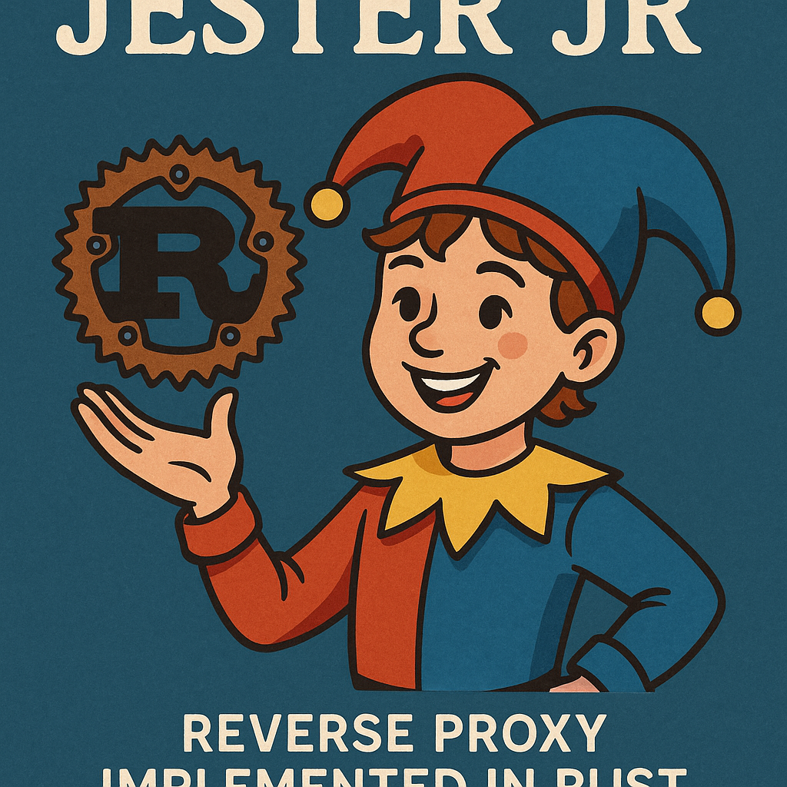

# 🃏 Jester Jr - A Rust Reverse Proxy



[](https://www.rust-lang.org/)
[](LICENSE)
[](src/config.rs)

A production-ready HTTP reverse proxy built from scratch in Rust, featuring bidirectional streaming, comprehensive HTTP parsing, and flexible configuration-based request/response filtering.

## ✨ Features

### Core Proxy Capabilities
- 🔄 **Bidirectional Streaming** - Concurrent request and response streaming with separate threads
- 🚀 **Zero-Copy Body Transfer** - Efficient memory usage with constant 8KB buffers
- 📊 **Full HTTP Parsing** - Complete request and response header parsing
- ⏱️ **Production Timeouts** - Configurable timeouts prevent hanging connections
- 🛡️ **Robust Error Handling** - Graceful degradation, no panics
- 📝 **Detailed Logging** - Comprehensive activity logging with emoji indicators

### Filtering & Security
- 🔍 **Regex Path Matching** - Flexible URL-based filtering
- 🔐 **Header Requirements** - Enforce authentication and other headers
- 🚫 **Method Filtering** - Control allowed HTTP methods
- 📏 **Response Size Limits** - Prevent bandwidth exhaustion
- 🔢 **Status Code Filtering** - Hide backend errors from clients
- ⚙️ **TOML Configuration** - Easy-to-edit configuration files

## 🚀 Quick Start

### Prerequisites
- Rust 1.75 or newer
- Cargo (comes with Rust)

### Installation

```bash
# Clone the repository
git clone https://github.com/yourusername/jester-jr
cd jester-jr

# Build release version
cargo build --release

# Run with default config
./target/release/jester-jr
```

### Basic Configuration

Create `jester-jr.toml`:

```toml
[proxy]
listen_address = "127.0.0.1:8080"
backend_address = "127.0.0.1:9090"
timeout_seconds = 30

[[request_rules]]
name = "Allow API access"
action = "allow"
path_regex = "^/api/.*"
methods = ["GET", "POST"]
```

### Testing

```bash
# Start a backend server (example with Python)
python3 -m http.server 9090 &

# Start Jester Jr
./target/release/jester-jr jester-jr.toml &

# Test the proxy
curl http://localhost:8080/api/test
```

## 📖 Documentation

- **[USAGE.md](USAGE.md)** - Detailed usage guide with examples
- **[ROADMAP.md](ROADMAP.md)** - Future features and development plans
- **[CONFIG_FILTERING.md](CONFIG_FILTERING.md)** - Filtering system details

## 🏗️ Architecture

```
┌─────────────────────────────────────────────────────────────┐
│                        Client                               │
└──────────────────────────┬──────────────────────────────────┘
                           │ HTTP Request
                           ▼
┌────────────────────────────────────────────────────────────┐
│                      Jester Jr Proxy                       │
│                                                            │
│  ┌────────────────────────────────────────────────────┐    │
│  │ 1. Parse Request Headers                           │    │
│  │    • Method, Path, Version                         │    │
│  │    • All Headers (case-insensitive)                │    │
│  │    • Content-Length detection                      │    │
│  └────────────────────────────────────────────────────┘    │
│                           ↓                                │
│  ┌────────────────────────────────────────────────────┐    │
│  │ 2. Evaluate Request Rules (First Match Wins)       │    │
│  │    • Path regex matching                           │    │
│  │    • Method filtering                              │    │
│  │    • Header requirements                           │    │
│  │    • Action: Allow or Deny                         │    │
│  └────────────────────────────────────────────────────┘    │
│                           ↓                                │
│  ┌────────────────────────────────────────────────────┐    │
│  │ 3. Forward Headers to Backend                      │    │
│  └────────────────────────────────────────────────────┘    │
│                           ↓                                │
│  ┌────────────────────────────────────────────────────┐    │
│  │ 4. Bidirectional Streaming                         │    │
│  │    Thread 1: Client → Backend (Request Body)       │    │
│  │    Thread 2: Backend → Client (Response)           │    │
│  └────────────────────────────────────────────────────┘    │
│                           ↓                                │
│  ┌────────────────────────────────────────────────────┐    │
│  │ 5. Parse Response Headers                          │    │
│  │    • Status Code, Status Text                      │    │
│  │    • All Headers                                   │    │
│  │    • Content-Length detection                      │    │
│  └────────────────────────────────────────────────────┘    │
│                           ↓                                │
│  ┌────────────────────────────────────────────────────┐    │
│  │ 6. Evaluate Response Rules                         │    │
│  │    • Status code filtering                         │    │
│  │    • Size limit checks                             │    │
│  │    • Action: Allow or Deny                         │    │
│  └────────────────────────────────────────────────────┘    │
│                           ↓                                │
│  ┌────────────────────────────────────────────────────┐    │
│  │ 7. Stream Response Body to Client                  │    │
│  └────────────────────────────────────────────────────┘    │
└──────────────────────────┬─────────────────────────────────┘
                           │ HTTP Response
                           ▼
┌─────────────────────────────────────────────────────────────┐
│                        Client                               │
└─────────────────────────────────────────────────────────────┘
```

## 📊 Performance

| Metric                 | Value        | Notes                           |
| ---------------------- | ------------ | ------------------------------- |
| Filtering Overhead     | <1ms         | Per request, with 10-20 rules   |
| Memory per Connection  | ~16KB        | 2x 8KB buffers                  |
| Thread per Request     | 1 (for body) | Only if request has body        |
| Regex Compilation      | Startup only | Pre-compiled, zero runtime cost |
| Concurrent Connections | OS-limited   | Thread per connection model     |

## 🎯 Use Cases

### Development & Testing
- Local API gateway for microservices
- Request/response inspection and logging
- Testing authentication flows
- Rate limiting (planned)

### Production Scenarios
- Simple API gateway
- Path-based routing
- Method whitelisting for security
- Error response filtering
- Content size enforcement

### Security Applications
- Block admin/sensitive paths
- Enforce authentication headers
- Hide backend error details
- Prevent large response attacks

## 🔧 Configuration

### Basic Setup

```toml
[proxy]
listen_address = "127.0.0.1:8080"    # Proxy listen address
backend_address = "127.0.0.1:9090"   # Backend server address
timeout_seconds = 30                  # Connection timeout
```

### Request Filtering Examples

```toml
# Block admin paths
[[request_rules]]
name = "Block admin access"
action = "deny"
path_regex = "^/admin/.*"

# Require authentication for protected paths
[[request_rules]]
name = "Protected paths with auth"
action = "allow"
path_regex = "^/protected/.*"
require_header = "Authorization"

[[request_rules]]
name = "Protected paths without auth"
action = "deny"
path_regex = "^/protected/.*"

# Method whitelisting
[[request_rules]]
name = "Read-only API"
action = "allow"
path_regex = "^/api/.*"
methods = ["GET", "HEAD", "OPTIONS"]
```

### Response Filtering Examples

```toml
# Hide backend errors
[[response_rules]]
name = "Block server errors"
action = "deny"
status_codes = [500, 501, 502, 503, 504]

# Limit response size
[[response_rules]]
name = "Block large responses"
action = "deny"
max_size_bytes = 10485760  # 10 MB
```

See [USAGE.md](USAGE.md) for complete configuration guide.

## 🧪 Testing

```bash
# Run all tests
cargo test

# Run with output
cargo test -- --nocapture

# Run specific test
cargo test test_parse_config

# Run with coverage (requires cargo-tarpaulin)
cargo tarpaulin --out Html
```

### Test Coverage
- ✅ Config parsing and validation
- ✅ Request rule evaluation
- ✅ Response rule evaluation
- ✅ Regex pattern matching
- ✅ Header requirement checks
- ✅ Size limit validation

**Current Status: 12/12 tests passing (100%)**

## 📦 Dependencies

```toml
[dependencies]
serde = { version = "1.0", features = ["derive"] }  # Config deserialization
toml = "0.5"                                        # TOML parsing
regex = "1.10"                                      # Pattern matching
```

All dependencies are well-maintained, widely-used crates from the Rust ecosystem.


## 🗺️ Roadmap

**Current Version: 0.1.0 - Core Proxy + Filtering** ✅

**Planned Features:**
- [ ] Rate limiting per IP/path
- [ ] Multiple backend servers (load balancing)
- [ ] Health checks with automatic failover
- [ ] Prometheus metrics endpoint
- [ ] TLS/HTTPS support
- [ ] WebSocket proxying
- [ ] Request/response transformation
- [ ] Hot config reload

See [ROADMAP.md](ROADMAP.md) for detailed development plans.

## 🤝 Contributing

Contributions are welcome! This is a learning project, so feel free to:
- Add features from the roadmap
- Improve documentation
- Add more tests
- Optimize performance
- Report bugs or suggest improvements

## 📄 License

MIT License - See [LICENSE](LICENSE) file for details

## 🙏 Acknowledgments

Built as a hands-on learning project to master Rust fundamentals through practical implementation of a production-grade reverse proxy.

Special thanks to:
- The Rust community for excellent documentation
- The authors of `serde`, `toml`, and `regex` crates
- Everyone who provides feedback and suggestions

## 📞 Support

- 📖 **Documentation**: See docs in this repository
- 🐛 **Bug Reports**: Open an issue on GitHub
- 💡 **Feature Requests**: Open an issue with the "enhancement" label
- 💬 **Questions**: Open a discussion on GitHub

## 🌟 Star History

If you find this project useful for learning Rust or as a lightweight proxy solution, please consider giving it a star!

---

**Status**: Production-Ready ✅ | **Tests**: 12/12 Passing ✅ | **Docs**: Complete ✅

Built with ❤️ and 🦀 Rust